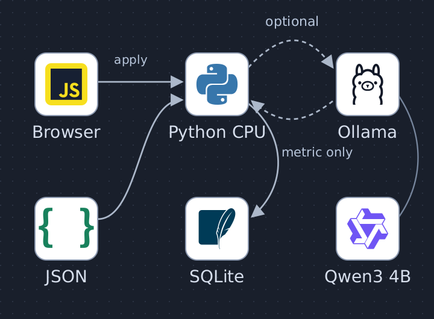
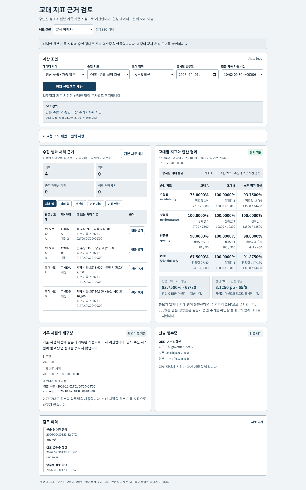
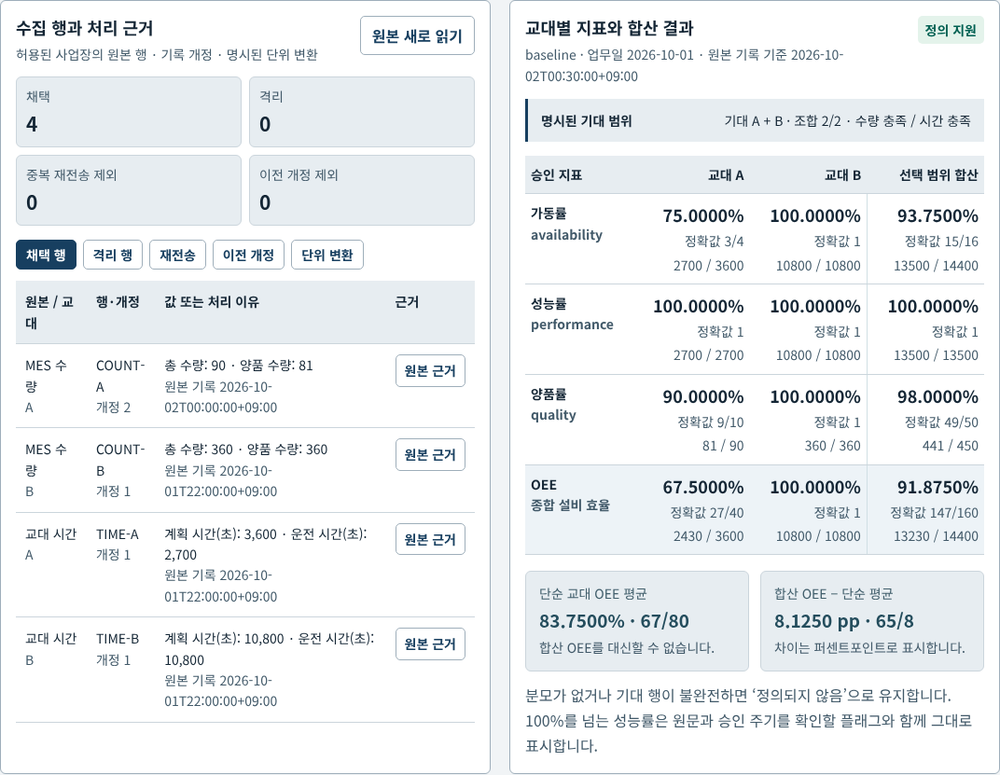
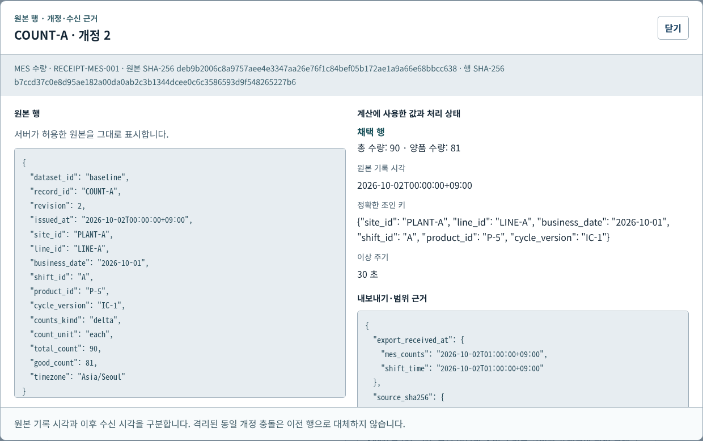
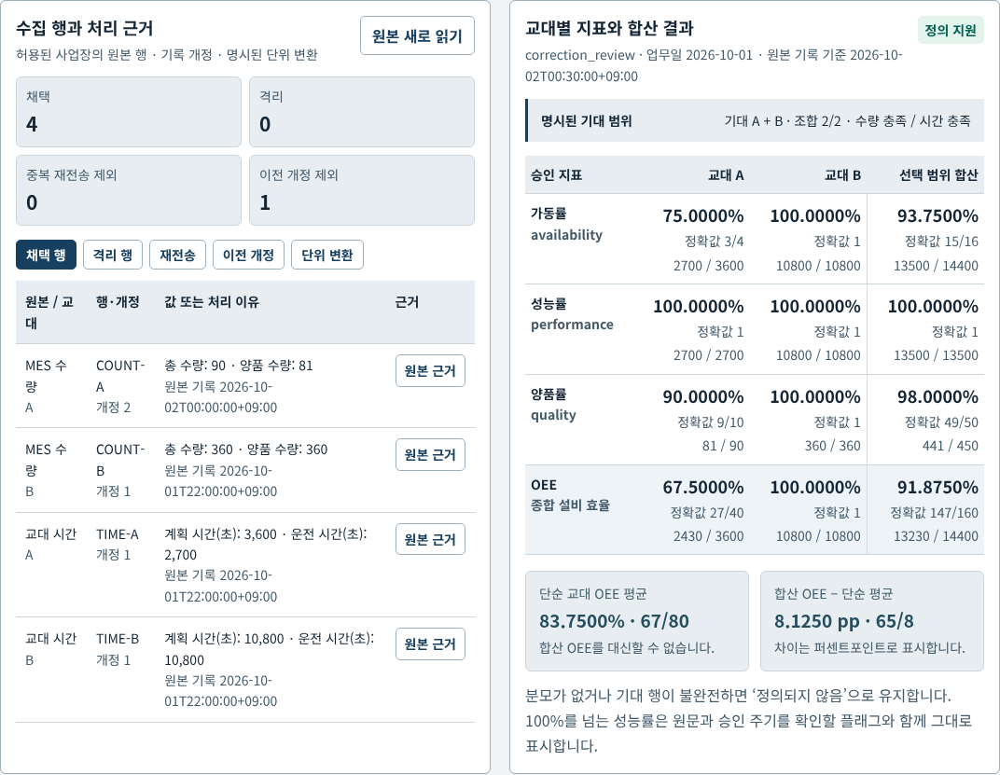
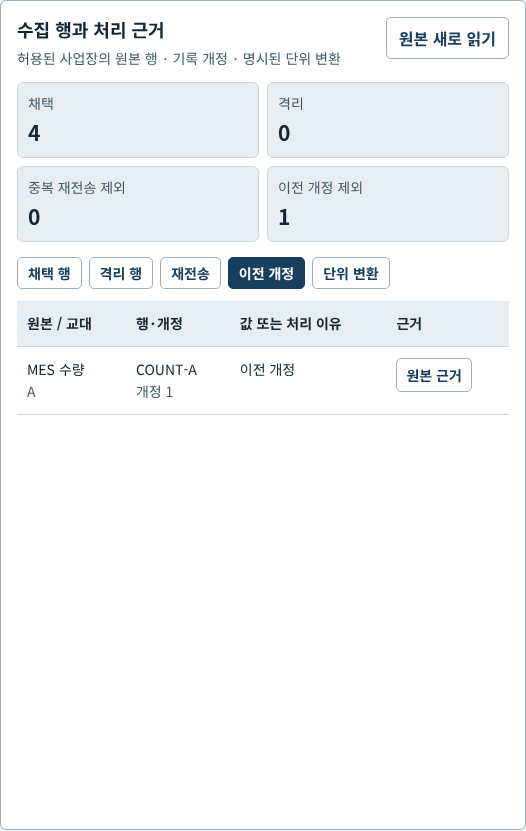
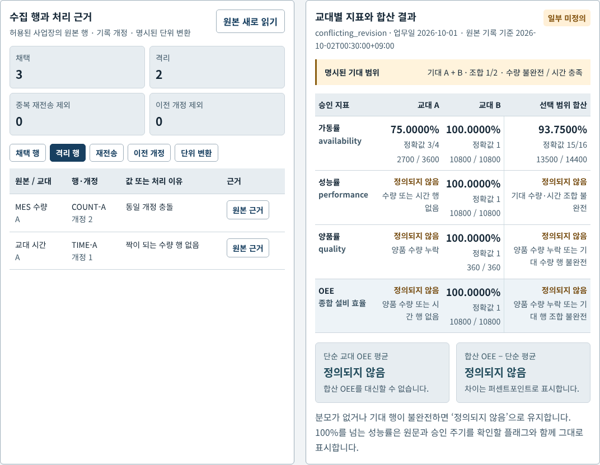
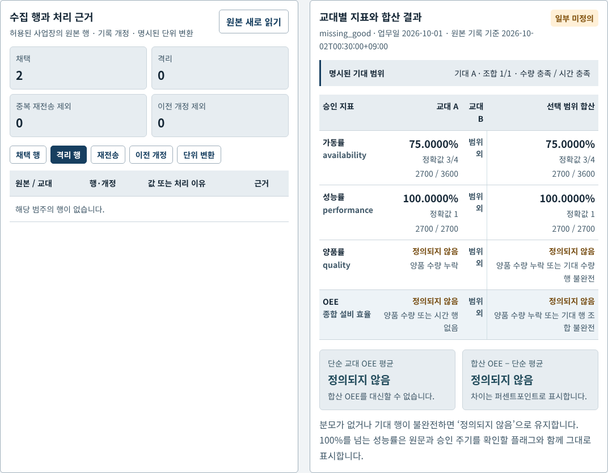
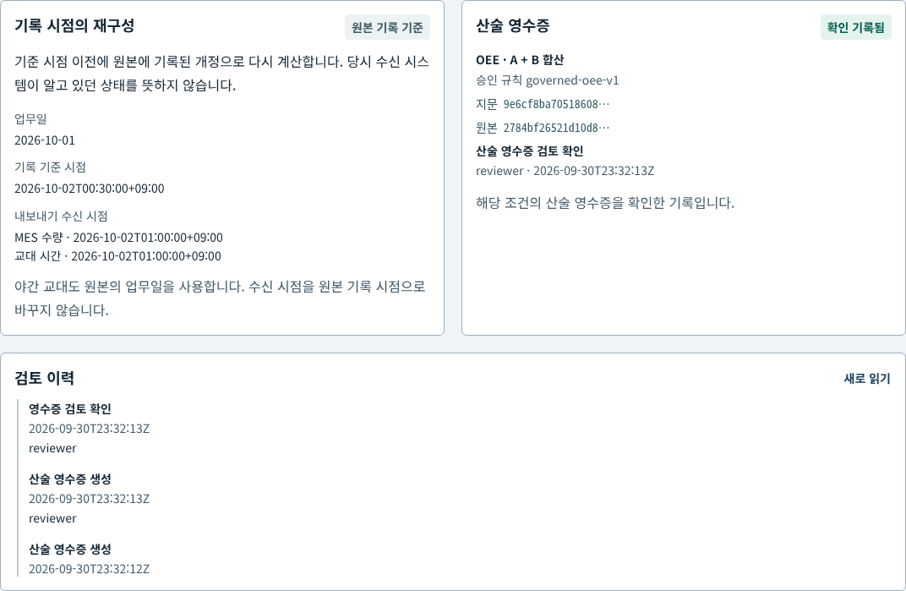
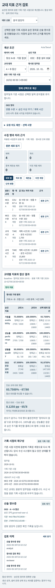

# Governed Shift Metric Review

## 구성도

Browser·고정 JSON → Python CPU 권한·개정·조인·Fraction 계산 → SQLite 영수증·검토 감사. 선택형 Ollama/Qwen은 지표 ID만 제안하고, 사람이 적용한 뒤 계산합니다. [편집 가능한 SVG와 출처](docs/architecture-provenance.md).

제조업 전산실·생산 데이터 담당자가 **MES 수량과 교대 시간의 조인·단위·개정 근거를 확인하고, 승인된 정의로 계산한 지표를 검토**하는 자체 합성 업무 프로토타입입니다. 계산 결과를 만드는 대화형 모델 대신, 정확한 산술 영수증과 원본 행을 중심에 둡니다.

> 이 저장소는 합성 데이터에 대한 재현 가능한 자체 검증입니다. 실제 공장 OEE·생산성·ROI 개선, 제조 전문가 검증, 운영용 SSO를 입증하지 않습니다.

## 현재 화면 · P09 v2 기준

원본과 계산 결과를 같은 높이의 2열 카드에 두고, 선택 조건·기록 기준 시점·검토 근거를 따라 읽도록 정리했습니다. 아래 이미지는 **2026-09-30 현재 UI를 실제 Chrome에서 캡처**했습니다. 합성 자료와 CPU 계산이며 이 화면 확인 과정의 모델 호출은 0회입니다. [현재 동작 영상](docs/demo/current/workflow.mp4)은 같은 Chrome 화면의 실제 상호작용 기록을 코덱만 변환한 것입니다. [캡처 해시·검증 기록](docs/demo/current/README.md)을 함께 제공합니다.

1. 선택한 승인 지표와 원본 행, A·B 합산 영수증. 합산 OEE는 정확한 147/160이며 83.75%는 잘못된 단순평균의 반례입니다.

   

2. 채택 행과 원본 근거 버튼.

   

3. 허용된 원본 행·출처 해시·처리 상태를 함께 여는 근거 창.

   

4. 정정 전 23:30 기록 기준의 합산 OEE 11/12.

   

5. 정정 후 00:30 기록 기준의 합산 OEE 147/160.

   

6. 현재 합산에서 제외된 이전 개정 기록.

   

7. 동일 개정 충돌 시 행 격리와 미정의 합산 결과.

   

8. 양품 누락 시 0으로 대체하지 않고 가동률과 미정의 OEE를 분리.

   

9. 검토 담당자의 영수증 확인 기록과 이력. 통제 효과나 생산 성과 승인과 다릅니다.

   

10. 실제 390px 모바일 화면의 선택·근거·결과 순서.

    

이전 [화면 갤러리와 영상](docs/demo/README.md)은 **개편 전 기록**으로 남겨 두었습니다. 현재 UI의 재현 근거는 위 현재 화면 묶음입니다.

## 처음 실행할 업무

1. 분석 담당자로 데이터 사례·업무일·원본 기록 기준 시점·교대를 선택합니다.
2. 기대 범위 A+B와 실제 채택·격리·재전송·이전 개정 행을 비교합니다.
3. 분자·분모·정확한 분수로 계산한 지표를 확인하고 원문 행 drawer를 엽니다.
4. 선택 사항인 한국어 요청은 지표 제안을 받고 **사람이 확인한 뒤** 선택값에 적용합니다.
5. 검토 담당자가 특정 원본·선택 조건·규칙의 영수증을 확인했다는 기록을 남깁니다.

두 자료는 MES의 교대별 차분 수량과 별도 교대 시간 내보내기입니다. 사업장·라인·명시 업무일·교대·제품·승인 주기 버전이 모두 일치해야 조인합니다. 임의 SQL, 생산 시스템 연결, 설비 제어, 원본 수정 API는 없습니다.

## 실제 업무 참고와 우리 구현의 차이

| 공개 사례 | 공개 자료의 성숙도 | 이 저장소에서 재현한 업무 | 아직 없는 부분 |
|---|---|---|---|
| [ACME Corrugated Box / Microsoft Fabric](https://www.microsoft.com/en/customers/story/27103-acme-corrugated-box-microsoft-fabric) | 도입된 통합 데이터·KPI 기반; 자연어 AI는 향후 방향 | 단위 변환, 정의된 KPI, 원본 추적 | Fabric, 실제 MES 수집, 기업 규모 운영 |
| [Basalt AG / Microsoft Fabric](https://www.microsoft.com/en/customers/story/26319-basalt-ag-microsoft-fabric) | 의미 정의 통일과 단계적 확산 진행 | 고정 조인 키·지표 카탈로그·버전 조건 | 다사업장 의미 모델 운영 |
| [Schneider Electric product-owner interview](https://blog.se.com/digital-transformation/artificial-intelligence/2025/02/10/podcast-navigating-sustainability-data-with-genai-copilot/) | 모델 의도를 기존 API 계산으로 연결하는 제품 담당자 설명 | 선택 가능한 의도 제안 → 승인 카탈로그 → CPU 계산 | 해당 제품·비공개 구현·실제 고객 데이터 |
| [Bridgestone EMEA / Microsoft Fabric](https://www.microsoft.com/en/customers/story/23047-bridgestone-emea-microsoft-fabric) | 제조 데이터 자연어 활용 초기 사례와 후속 확장 | 한국어 지표 선택 제안, 권한 범위 유지 | 현업 정확도·사용성·확산 검증 |

공개 사례는 업무 설계 참고입니다. 기업의 비공개 아키텍처를 복제했다거나 우리 구현이 해당 기업에 도입됐다고 주장하지 않습니다.

## 계산 계약

한 제품·승인 주기 버전에서만 합산합니다. 모든 계산은 Python 정수와 Fraction이며, JS에는 정확값과 표시용 소수를 **문자열**로 전달합니다.

| 지표 | 분자 / 분모 |
|---|---|
| Availability | 운전 초 / 계획 초 |
| Performance | 총 수량 × 승인 이상 주기 초 / 운전 초 |
| Quality | 첫 통과 양품 수량 / 총 수량 |
| OEE | 첫 통과 양품 수량 × 승인 이상 주기 초 / 계획 초 |

합산은 분자와 분모를 합칩니다. 교대별 백분율의 단순 평균을 대체값으로 쓰지 않습니다. 초와 분의 명시적 변환만 허용합니다. 분모 0은 미정의, 양품 누락은 Quality/OEE 미지원, 양품>총량은 격리입니다. 100% 초과 Performance는 그대로 표시하고 검토 플래그를 붙입니다. 제품·주기 버전 혼합, 누적 수량, 미지원 단위, 모호한 조인은 차단합니다.

### 모델 사용 전에 고정한 기준 사례

| 조건 | 교대 A | 교대 B | A+B |
|---|---:|---:|---:|
| 계획 / 운전 | 3,600 / 2,700 초 | 180 / 180 분 | 14,400 / 13,500 초 |
| 총량 / 첫 통과 양품 | 90 / 81 | 360 / 360 | 450 / 441 |
| 승인 이상 주기 | 30초 | 30초 | 동일 버전 IC-1 |
| OEE | 27/40 = 67.5% | 1 = 100% | 147/160 = 91.875% |

합산 Availability 93.75%, Performance 100%, Quality 98%입니다. 단순 교대 OEE 평균은 83.75%; 합산과의 차이는 **8.125 퍼센트포인트**입니다. 이는 만든 수치 사례이며 현장 성과가 아닙니다.

보정 사례는 COUNT-A rev1 양품80을 10/01 23:00(+09:00), rev2 양품81을 10/02 00:00(+09:00)에 기록합니다. 기준 시점23:30에는 11/12=91.6667%, 다음날00:30에는147/160=91.8750%입니다. 내보내기 수신은 그 뒤이므로 **원본 기록 시점의 사후 재구성**이며 “당시 수신 시스템이 알고 있던 값”은 아닙니다. 시간 길이에서 교대 시작·종료를 추정하지 않습니다.

## 설치와 실행

Linux Python3.10+와 표준 라이브러리만 사용합니다. 기본 계산에는 Ollama·GPU·패키지 설치가 필요 없습니다.

~~~sh
git clone https://github.com/Kimhyuntae9665/governed-shift-metric-review.git
cd governed-shift-metric-review
python3 -m venv --without-pip .venv
.venv/bin/python -m unittest discover -s tests -v
.venv/bin/python -m metric_review.server --port 19084
~~~

같은 컴퓨터의 브라우저에서 http://127.0.0.1:19084 를 엽니다. 기본 DB는 data/metrics.sqlite3, 별도 DB는 --db로 지정합니다. 서버는 loopback에만 바인딩합니다. 데모 신원은 분석 담당자·검토 담당자·데이터가 없는 다른 사업장입니다. 로그인 제공자·실제 SSO가 아닙니다.

### 선택 사항: 기존 로컬 모델

[Ollama](https://github.com/ollama/ollama) 로컬 서버와 이미 설치한 [Qwen3 4B](https://huggingface.co/Qwen/Qwen3-4B)가 있을 때만 모델 제안을 선택합니다. 검증 환경은 Ollama0.17.7, qwen3:4b Q4_K_M, RTX4060 8GB입니다. 이 프로젝트의 스크립트는 모델 다운로드·업데이트를 수행하지 않습니다.

모델은 유한 카탈로그에서 **지표 ID 하나**만 제안합니다. 교대 범위는 명시적 문자열 파서가 처리하고, 데이터 사례·날짜·기준 시점은 사용자가 선택합니다. 모델은 원본 행·정답·숫자·SQL·계산 도구를 받지 않습니다. 제안 확인은 계산 요청 및 영수증 검토 확인과 별개의 단계입니다.

localhost 1요청, 컨텍스트4096, 출력256, temperature0, think:false, truncate:false, shift:false를 요청합니다. 설치 template에 생각 끄기 분기가 없어, 이 JSON 측정에서 thinking이 비어도 일반 자유문 답변의 thinking-off를 보장하지 않습니다. keep_alive는 prefix cache 적중 측정이 아닙니다. CAG 구현이나 cache hit을 주장하지 않습니다.

공유 inference lease와 timeout barrier 절차는 [운영 안내](docs/runbook.md)를 따릅니다. 모델 오류를 키워드 성공으로 조용히 바꾸지 않습니다. 기본 키워드 방식 또는 직접 선택으로 명시적으로 전환할 수 있습니다.

## 검증 자료와 분모

- Python 테스트 **74개 = 고정 합성 gold23개 + 나머지 공학 회귀51개**. gold를 별도23개로 더해 합산하지 않습니다.
- 실제 Chrome 브라우저 **11개 사례 / 97개 assertion / CPU 화면16장 + 실제 모델 흐름 화면4장**. 자세한 구성은 [UI 검증](docs/ui.md)에 따릅니다. CPU 계산·명시적 UI 경계 시험이며 실제 모델 평가와 다릅니다.
- 모델 개발 측정과 최초 실패는 [평가 manifest](docs/evaluation.md) 및 raw trace에 따릅니다. 같은 개발 사례를 수정 전후 반복한 것이며 독립 heldout 정확도가 아닙니다.
- 독립 검토에서 발견한 승인 플래그 타입·최신 개정 fallback·SQLite 연결 간 중복 검토 경합을 수정했고 해당 회귀를 보호합니다. 검토 범위와 잔여 제한은 [보안 기록](docs/security-review.md)에 명시합니다.

[실제 화면 갤러리·영상](docs/demo/README.md), [설계](docs/architecture.md), [실패 기록](docs/failure-log.md), [고정 데이터 계약](docs/contract.md)을 함께 확인하세요.

## 구조와 안전 경계

~~~text
브라우저 → loopback HTTP API → 권한/범위 검사 → 고정 snapshot/카탈로그
                                          → 개정·조인·단위 검사 → Fraction 계산
                                          → SQLite 영수증/검토 감사
선택 사항: 한국어 요청 → 정책 검사 → localhost Qwen 지표 ID 제안 → 사람 확인
~~~

원본 해시·카탈로그·범위·선택 조건·규칙 버전을 fingerprint에 결합합니다. 원본 변경/해시 실패에는 이전 결과·검토 표시를 숨기고 재계산을 요구합니다. 동일 내용 검토 재요청은 중복 감사 기록을 만들지 않습니다. 고정 과거 기준 시점 영수증은 역사 자료로 남으며, UI에서 현재 선택을 바꾸면 새 계산 전까지 그 결과를 현재 값으로 표시하지 않습니다.

## 현재 한계와 다음 단계

실제 MES connector, 동적 지표 편집, 실시간 수집, 제품 혼합 OEE, 교대 달력 추론, SSO, 운영 분산 락, 제조 전문가 승인과 산업 벤치마크는 없습니다. 승인 snapshot 교체는 별도 고정·해시 검증이 필요하며 UI/API에서 원본을 쓰지 않습니다. 인메모리 데모 세션은 재시작 시 만료됩니다. 실제 모델 개발 측정은 작은 반복 표본이며 한국어 일반화 성능을 보장하지 않습니다.

다음 단계는 새 독립 의도 질의, 수신 시점까지 엄격히 분리한 bitemporal ingestion, 명시 교대 달력, 승인 snapshot 교체 절차, 실제 기업 인증 adapter 검토입니다. 라이브 시스템 연결은 별도 범위와 권한이 필요합니다.

## 라이선스·데이터·재사용

코드와 자체 합성 fixture는 MIT. Ollama와 Qwen 모델은 각 배포처 라이선스가 별도로 적용되며 가중치를 포함하지 않습니다. 기업 자료·기술 로고는 출처/권리 표기에 따르고 우리 MIT 코드로 재라이선스하지 않습니다. n8n 템플릿 JSON을 복사·활성화하지 않았습니다. [재사용 기록](docs/reuse.md)과 diagram asset provenance를 참고하세요.

## Source display boundary follow-up

Authorized evidence uses server-produced exact row text, preserves a selected category across delayed source reads, and shows the server audit timestamp. The current native CPU run passes11 calculation scenarios and97 assertions with16 screenshots. A separate isolated real HTTP source fixture passes4 assertions and1 screenshot for integer9007199254740993; it does not alter frozen inputs or add benchmark cases. The74 Python tests comprise23 frozen gold cases and51 other regressions. Independent read-only review found no additional High/Medium issue. See [UI evidence and limits](docs/ui.md).

## Windows CPU startup

`.gitattributes` keeps hashed source files in LF form even when Git uses `core.autocrlf=true`; do not rewrite fixture bytes or regenerate source manifests to bypass an integrity failure. From a fresh clone, run `python -X utf8=0 scripts/check_startup.py` for a model-free startup/integrity check. The same check runs on Windows CI. Optional local-model lease and model-runner tests still require Linux/POSIX; this CPU startup check does not claim Windows inference support.

## 한국어 질문 범위

화면과 같은 `양품률`, `종합 설비 효율`과 한국어 조사를 인식합니다. A/B 두 교대만 있는 카탈로그에서 `교대 B를 제외한 OEE`는 A를 제안합니다. 두 교대를 함께 거론한 제외, 이중 부정, 알 수 없는 교대는 합산으로 추측하지 않고 명확화를 요청합니다. 모델 모드에서도 같은 교대 파서를 먼저 적용합니다. 이 변경은 계산 결과나 기존 고정 평가 자료를 바꾸지 않습니다.
